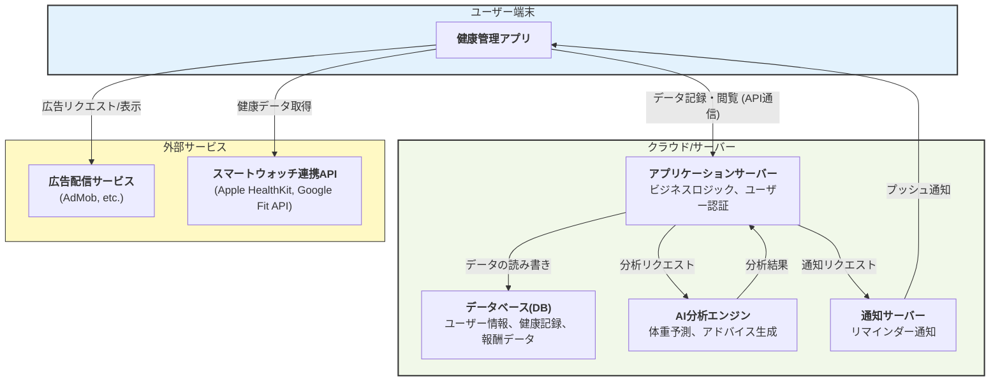
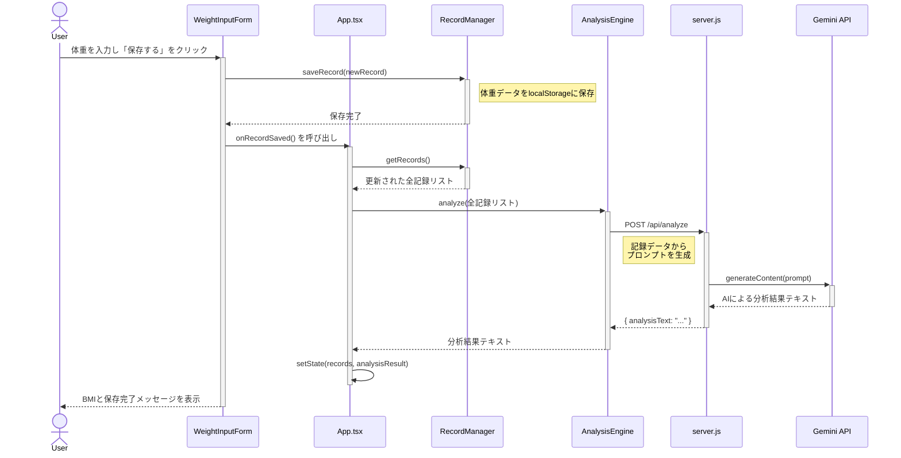

これを動かすためには、git cloneで取得したフォルダの一番浅い階層に.envファイルを作成して以下の内容を記述してください。
+ GEMINI_API_KEY="あなたのAPI KEY"
+ VITE_GOOGLE_CLIENT_ID="GCPで取得したID"
+ GOOGLE_CLIENT_ID="GCPで取得したID"
+ GOOGLE_CLIENT_SECRET="GCPで取得したクライアントシークレットのキー"

記述後にnode.jsとnpmをインストールし、以下のコマンドを入力したら動作する。
+ npm run dev
+ node server.js

